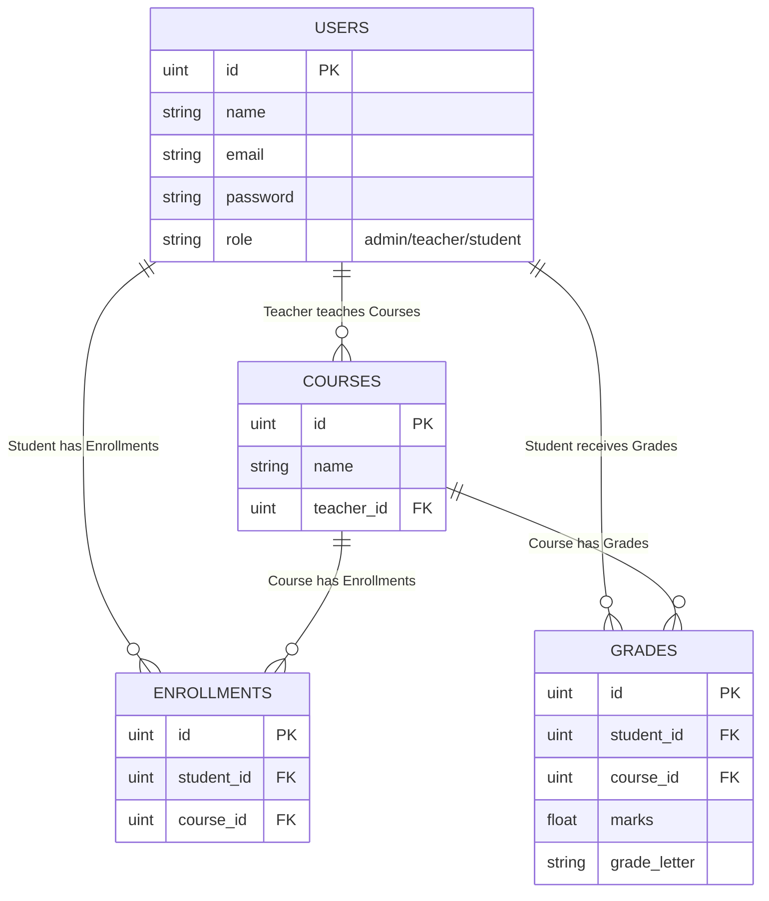

# Student Grade Management System API

This is a medium-level standard REST API built using Go (Golang), Gin web framework, and GORM with PostgreSQL. This project is a completely backend-focused API designed to be evaluated and tested via Postman.

## System Overview
The API manages courses, enrollments, and grades across three distinct roles:
1. **Admin**: Manages users (creates teachers/students) and courses.
2. **Teacher**: Enrolls students into their assigned courses, grades them, and views grade statistics.
3. **Student**: Views their enrolled courses, their grades, and their calculated GPA.

## Getting Started / Setup

### Running with Docker (Recommended)
You can easily spin up both the Go API and the PostgreSQL database using Docker. **No local PostgreSQL installation or manual database setup is required.**

1. **Start the Environment**
   Run the following command from the root directory:
   ```bash
   docker-compose up --build
   ```
   This will automatically build the Go application and start a PostgreSQL 15 database instance.

2. **Access the API**
   The server will be available at `http://localhost:8080`. The database will be available at `localhost:5432`.

*- Note on Seeding: If using Docker, you can run `docker exec grade_api ./main` to manually trigger seed scripts if they are compiled, but standard practice is running `go run seed/seed.go` with `.env` pointing to `localhost` to populate your dockerized DB.*

<hr/>

### Running Locally (Without Docker)

1. **Install Dependencies**
   Run the following command to download all required packages:
   ```bash
   go mod tidy
   ```

2. **Database Setup**
   Ensure PostgreSQL is running. Create a database named `student_grade_db` (or whatever you prefer) and set your environment variables if necessary. By default, it connects to PostgreSQL on `localhost:5432` with user `postgres` and password `password`.

3. **Database Seeding**
   To easily test the system, run the seed script which populates the database with an Admin, Teacher, Student, a course, and a grade.
   ```bash
   go run seed/seed.go
   ```

4. **Running the Server**
   ```bash
   go run main.go
   ```
   The server will start on port `8080`.

## ER Diagram



*Note: `ENROLLMENTS` and `GRADES` have unique constraints on `(student_id, course_id)` to prevent duplicate enrollments or duplicate grades per course.*

## How Authentication Works
Authentication is handled via JWT (JSON Web Tokens). 
When a user provides their email and password to the `/login` endpoint, they receive a JWT token. This token embeds the `user_id` and their specific `role`.

For protected routes, clients must send the token in the headers as:
`Authorization: Bearer <token>`

Two main middleware functions exist:
- `AuthRequired()`: Verifies the JWT signature and blocks unauthenticated requests.
- `RoleRequired(roles...)`: Ensures the logged-in user belongs to one of the authorized roles before proceeding to the controller.

## How GPA Works
The system automatically assigns a `grade_letter` based on marks (A: 90+, B: 80+, C: 70+, D: 60+, F: < 60). 
When a student requests their GPA, the system fetches all their grades and converts them to standard grade points:
- A = 4
- B = 3
- C = 2
- D = 1
- F = 0

**GPA Formula:** `Total Grade Points / Number of Courses Graded`
The calculation handles multiple courses properly and skips courses where they are enrolled but not yet graded.

## API Endpoints List

### Public Routes
- `GET /health` - Health check to verify server availability.
- `POST /register` - Registers a user, but forces the role to `student`. Admin/Teachers cannot register publicly.
- `POST /login` - Login to receive a JWT token.

### Admin Routes
- `POST /api/admin/users` - Creates a new user (Teacher or Student).
- `POST /api/admin/courses` - Creates a new course and assigns it to a teacher.
- `GET /api/admin/students` - Lists all students (with basic limit/offset pagination).
- `GET /api/admin/courses` - Lists all courses (with basic limit/offset pagination).

### Teacher Routes
- `GET /api/teacher/courses` - View all courses assigned to the logged-in teacher.
- `POST /api/teacher/enrollments` - Enroll a student into the teacher's course.
- `POST /api/teacher/grades` - Add or update a grade for a student in a course (Upsert logic).
     - Request body: `{"student_id": 1, "course_id": 1, "marks": 85.5}`
- `GET /api/teacher/courses/:courseId/stats` - Get a count of A, B, C, D, F grades for a course.

### Student Routes
- `GET /api/student/courses` - View all courses the student is enrolled in.
- `GET /api/student/grades` - View all grades the student has received.
- `GET /api/student/gpa` - Calculate and view the overall GPA.

---

## 🛠️ Troubleshooting & Common Errors

If you run into issues while building or seeding the project, here are the exact solutions for the problems you might face:

### 1. `failed SASL auth: FATAL: password authentication failed for user "postgres"`
**Why it happens:** You tried to run `go run seed/seed.go` on your host machine while the project uses Docker. Your local machine might have a conflicting PostgreSQL installation.
**The Fix:** You must run the seed script directly *inside* the Docker container where the database lives safely. Run this:
```bash
docker exec -it grade_api go run seed/seed.go
```

### 2. Gin/Go Version Dependency Error during Docker Build
**Why it happens:** Newer versions of standard HTTP packages (like `github.com/gin-contrib/sse`) strictly require Go 1.24, which broke the older `1.22-alpine` build.
**The Fix:** We updated the `backend/Dockerfile` to use `golang:1.24-alpine` so compilation passes automatically. Ensure you don't downgrade the `Dockerfile` base image.

### 3. Connection refused on localhost:8080 (Docker Container Networking)
**Why it happens:** When running locally, Gin binds to `localhost:8080` under the hood. In Docker, `localhost` only refers to the isolated container, making it completely unreachable from your Windows machine!
**The Fix:** We changed `r.Run(":" + port)` to `r.Run("0.0.0.0:" + port)` in `main.go`. This tells Gin to expose the port publicly so your physical machine can access the Docker network.

## Quality of Life / Professional Features Included
- **Health Check Endpoint**: Shows the server is running without needing authentication.
- **Unique Constraints**: Prevents a student from enrolling in the same course twice, or having duplicate grade entries.
- **Standardized Error Handling & JSON format**: Every response contains consistent `message` and `data` objects, or an `error` key.
- **Role Isolation**: Admin role CANNOT be created via the public register endpoint. Only a database seed or an existing Admin can elevate an account.
